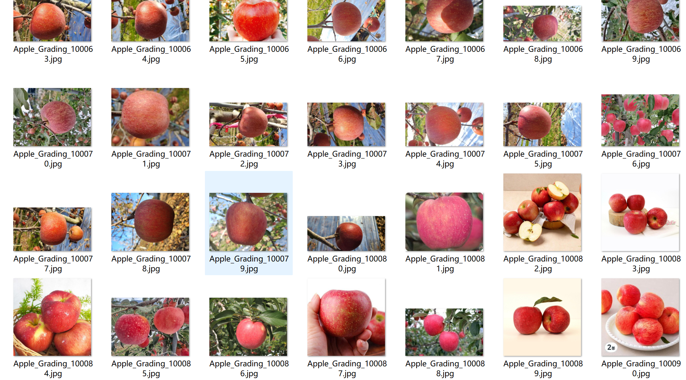
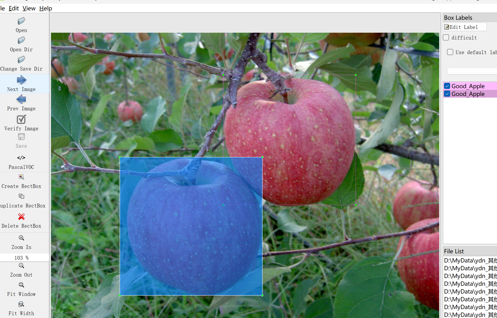
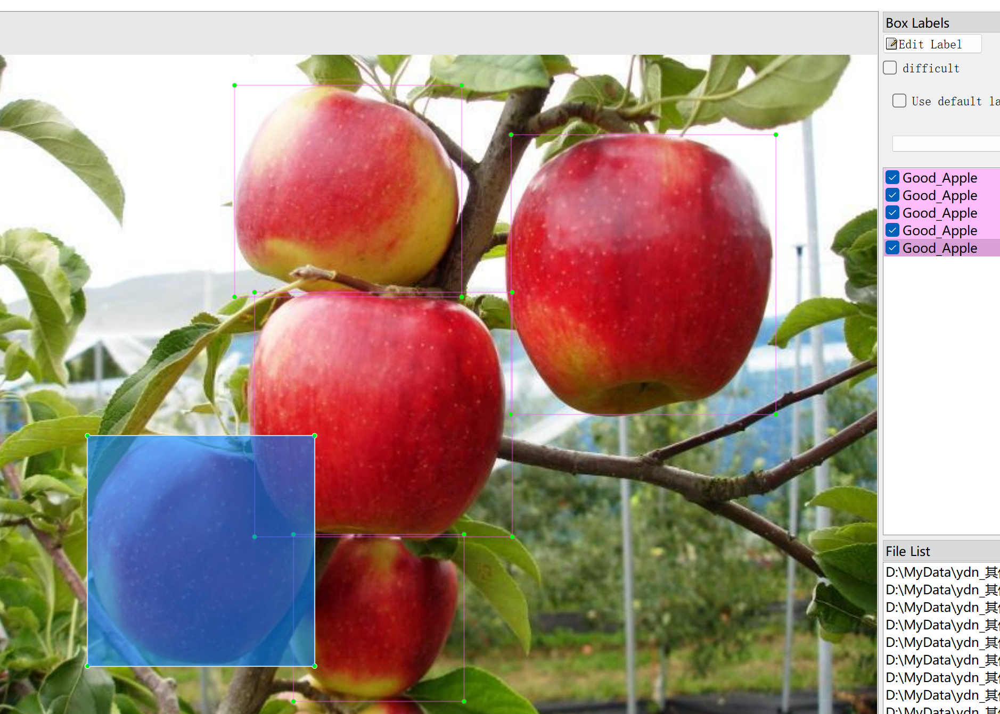
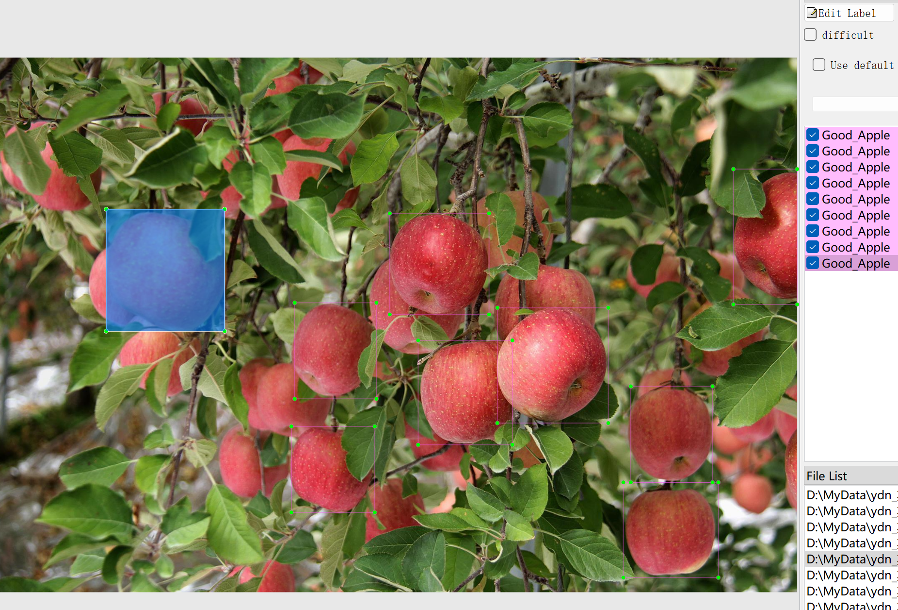

# Apple Freshness Detection - Object Detection Dataset

Dataset Information: A total of 6,000 images and corresponding annotation files are available. The annotation files are formatted in two ways: VOC format (xml files) and YOLO format (txt files).

The objects to be labeled include the following:
- [GoodApple]
- [RottenApple]

Each column of images and number of annotation boxes are detailed as follows: (Annotations are generally written in English, with Chinese provided in parentheses for reference)
Note: An image may contain multiple objects, so the total number of annotation boxes may be greater than the number of images.

The complete dataset consists of three directories and one txt file:
- all_txt directory and classes.txt: Store the YOLO format txt annotation files, which have the same quantity as the images, each annotation file is directly corresponding to an image
- classes.txt:
- all_xml directory: VOC format xml annotation file. The number and images are the same, each annotation file is directly corresponding to an image

For a detailed understanding of the VOC format standard files, please search for it yourself on Baidu.
Both formats are usable; choose either one based on your preference.
Annotation Screenshot:

## Images

Here is a pay link on Stripe ( https://buy.stripe.com/3cs8yP7sY87d0vu9AB ). Please contact me lonlonago@foxmail.com after funding $89, and I will send you a complete data files , thank you!

